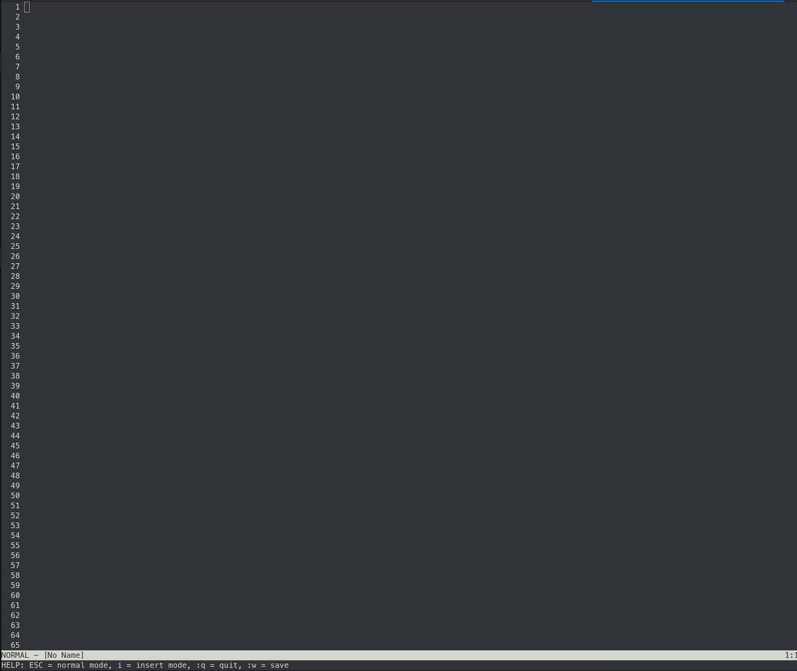

# ZIM

A simple text editor implemented in Zig `0.13`, inspired by the functionality of Vim. Learning POC,building a simple text editor from scratch using the Zig.


## Features

- **Normal Mode**: Navigate and manipulate text without inserting characters.
- **Insert Mode**: Type and edit text directly.
- **Command Mode**: Execute commands for saving and quitting (:q, :w :i)
- **Terminal UI**: Render the text buffer and handle user input in the terminal.

## Rationale

* No Dependencies, No Libs, No Frameworks, No C
* Purelly written in Zig
* Self-contained
* ~380 LoC

## Build

To build the text editor, navigate to the project directory and run:

```
zig build
```

## Running

After building, you can run the text editor with:
```
 ./zig-out/bin/zim
```
or just do:
```
zig build run
```



## Raw mode flags

This are the flags used to set the terminal to raw mode, allowing for direct control over input and output without interference from the terminal driver. This is crucial for implementing a text editor that behaves like Vim.

* `raw.lflag.ECHO = false` - Prevents typed characters from appearing automatically (you control what's displayed)
* `raw.lflag.ICANON = false` - Allows reading single characters instead of waiting for Enter
* `raw.lflag.ISIG = false` - Prevents Ctrl+C from killing your program (you handle ESC instead)
* `raw.lflag.IEXTEN = false` - Disables extended input processing
* `raw.iflag.IXON = false` - Disables software flow control (Ctrl+S/Ctrl+Q)
* `raw.iflag.ICRNL = false` - Prevents automatic CR to LF conversion
* `raw.iflag.BRKINT = false` - Disables break signal
* `raw.iflag.INPCK = false` - Disables parity checking
* `raw.iflag.ISTRIP = false` - Disables stripping of 8th bit
* `raw.oflag.OPOST = false` - Disables output processing